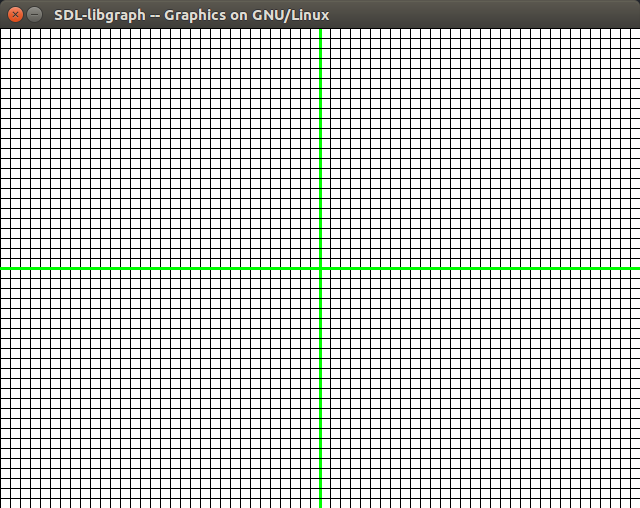
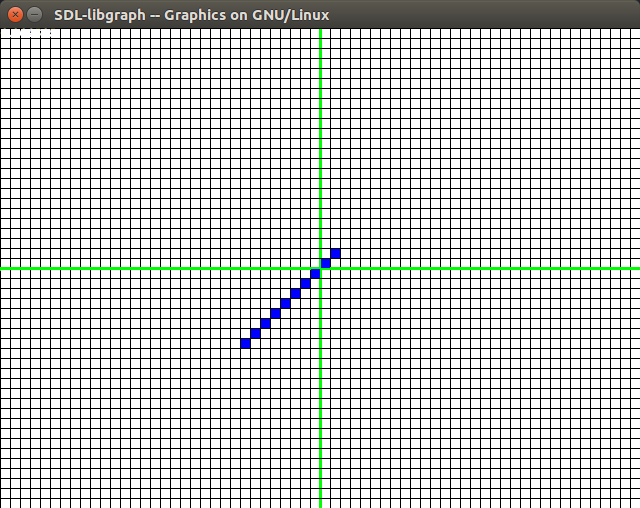
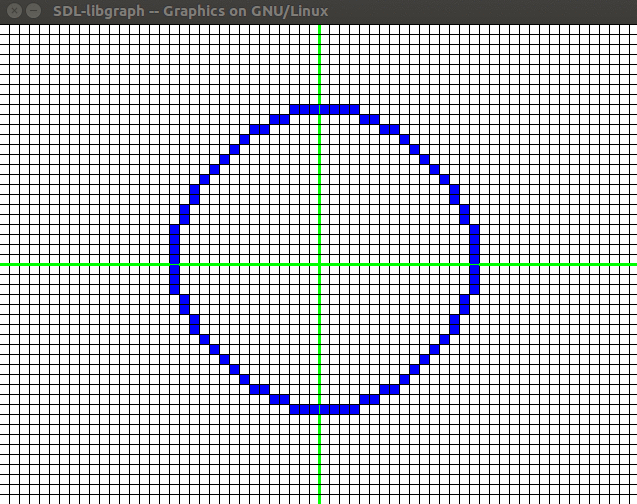
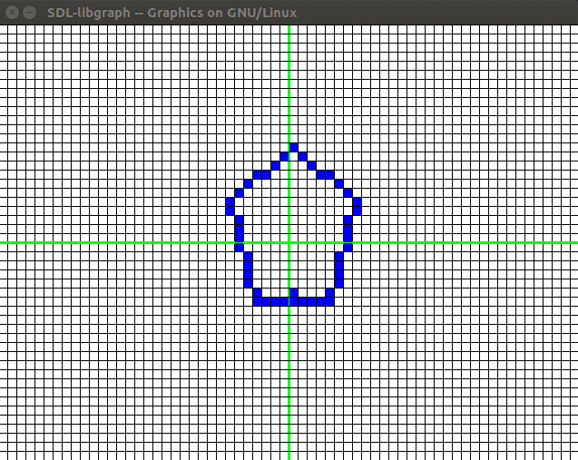
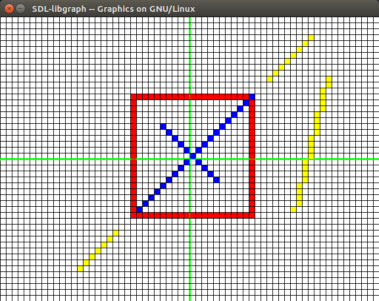
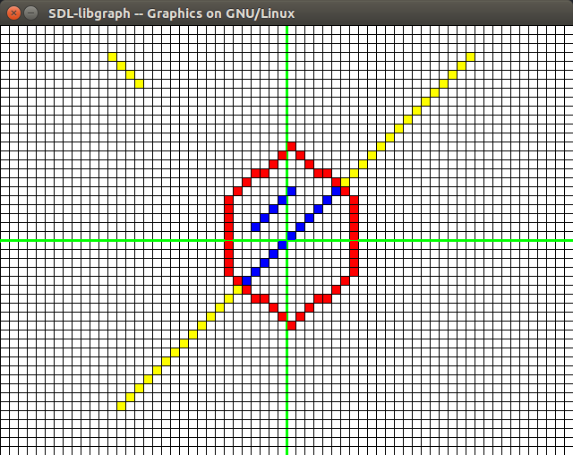
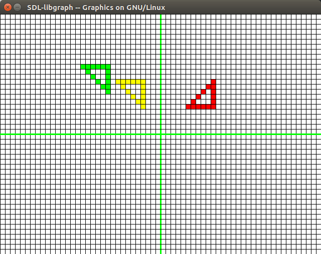
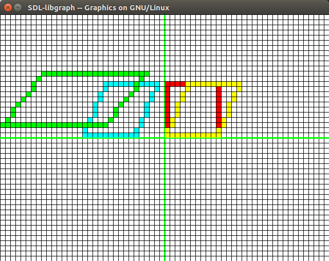
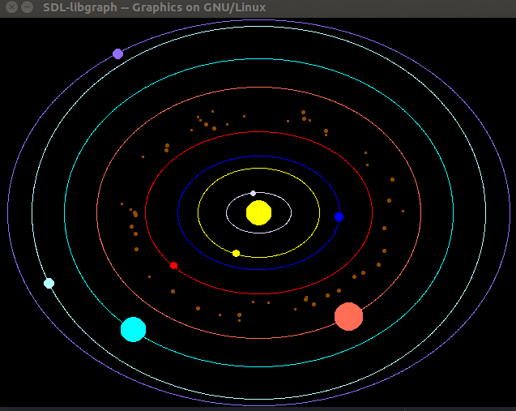

# Graphics Lab

## Index

|Sl No|Name|Assignment given on|Assignment to be submited on|
|:----:|----|----|----|
|1|Make a grid world|23.07.2017|24.07.2017|
|2|Write a program in C to implement DDA and Bresenham line drawing algorithms.|02.08.2017|07.08.2017|
|3|Circle using algebric equation and bressenham and compare execution time and selection of points|16.08.2017|21.08.2017|
|4|Fill hexagon using Seed fill and Scan line fill|23.08.2017|28.08.2017|
|5|Scan line-Seed Fill algorithm|31.08.2017|04.09.2017|
|6|Suderland-Cohen Line Clipping algorithm|06.09.2017|11.09.2017|
|7|Cyrus-Beck Algorithm|04.10.2017|09.10.2017|
|8|Rotation and Translation|20.10.2017|23.10.2017|
|9|Scaling Shrearing Reflection|28.10.2017|30.10.2017|
|10|Project: Solar System |||
---
## 1. Make a grid world

> Q: Make a grid in which all the following assignments will be displayed

Code is as follows:
```c
#include <graphics.h>
#include <stdio.h>
#include <math.h>
#define MAX_X 640
#define MAX_Y 480
#define SCALE 10
#define AXIS_COLOR GREEN
#define COLOR BLUE

void grid();

void initialiseGraph(){
    int gd = DETECT, gm;
    initgraph(&gd, &gm, NULL);
}
void grid(){
    int x,y;
    setbkcolor(WHITE);
    setcolor(BLACK);
    for(x=0; x<MAX_X; x+=SCALE) {
        if(x==MAX_X/2){
            setcolor(AXIS_COLOR);
            setlinestyle(0, 0, 2);
            line(x,0,x,MAX_Y);
            setcolor(BLACK);
            setlinestyle(0, 0, 1);
            continue;
        }
        line(x,0,x,MAX_Y);
    }
    for(y=0; y<MAX_Y; y+=SCALE) {
        if(y==MAX_Y/2){
            setcolor(AXIS_COLOR);
            setlinestyle(0, 0, 2);
            line(0,y,MAX_X,y);
            setcolor(BLACK);
            setlinestyle(0, 0, 1);
            continue;
        }
        line(0,y,MAX_X,y);
    }
}
```
> Output:



Since it's used to many other files I made a `graphics_utils.h` file and put all the basic codes in it. Then it was imported everytime.

The rest of the functions:
* For Pixel Drawing
```c
// Pixel drawing
int getPixelColor(int x, int y){
    int X = x*SCALE + MAX_X/2;
    int Y = -y*SCALE + MAX_Y/2;
    return getpixel(X + SCALE/2, Y - SCALE/2);
}
void drawPixel(int x, int y){
    int color = COLOR;
    int x_range = MAX_X / SCALE;
    int y_range = MAX_Y / SCALE;
    int X = x*SCALE + MAX_X/2;
    int Y = -y*SCALE + MAX_Y/2;
    setcolor(color);
    rectangle(X+1,Y-1,X+SCALE-1,Y-SCALE+1);
    floodfill(X+2,Y-2, color);
    setcolor(BLACK);
}
void drawColorPixel(int x, int y, int color){
    int x_range = MAX_X / SCALE;
    int y_range = MAX_Y / SCALE;
    int X = x*SCALE + MAX_X/2;
    int Y = -y*SCALE + MAX_Y/2;
    setcolor(color);
    rectangle(X+1,Y-1,X+SCALE-1,Y-SCALE+1);
    floodfill(X+2,Y-2, color);
    setcolor(BLACK);
}
```
* For Line Drawing
```c
// Line Drawing
void dda(int x1, int y1, int x2, int y2){
    if(x1==x2 && y1==y2) {
        drawPixel(x1,y1);
    } else if(x1==x2) {
        int i;
        int ymin = y1<y2?y1:y2;
        int ymax = y1<y2?y2:y1;
        for(i=ymin;i<=ymax;i++) {
            drawPixel(x1, i);
        }
    } else if (y1==y2) {
        int i;
        int xmin = x1<x2?x1:x2;
        int xmax = x1<x2?x2:x1;
        for(i=xmin;i<=xmax;i++) {
            drawPixel(i, y1);
        }
    } else {
        float dx, dy, len;
        if(abs(x1-x2)>abs(y1-y2)) {
            len = abs(x1-x2);
        } else {
            len = abs(y1-y2);
        }
        dx = (float)(x2-x1)/len;
        dy = (float)(y2-y1)/len;

        float x = x1;
        float y = y1;

        int i=0;
        while (i<=len) {
            drawPixel((int)x,(int)y);
            x += dx;
            y += dy;
            i++;
        }
    }
}
void bresenham(int x1, int y1, int x2, int y2){
    int x, y, dx, dy, s1, s2, interchange, e;
    x = x1;
    y = y1;
    dx = abs(x2 - x1);
    dy = abs(y2 - y1);
    // Initialze signs
    s1 = x1==x2?0:(x2>x1?1:-1);
    s2 = y1==y2?0:(y2>y1?1:-1);
    // Set interchange flag
    if(dy > dx ){
        interchange = 1;
        int temp = dx;
        dx = dy;
        dy = temp;
    }else{
        interchange=0;
    }
    e = 2 * dy - dx;

    int i;
    for(i=1;i<=dx;i++){
        drawPixel(x,y);
        while(e>0){
            if(interchange){
                x = x + s1;
            }else{
                y = y + s2;
            }
            e = e - 2*dx;
        }
        if(interchange){
            y = y + s2;
        }else{
            x = x + s1;
        }
        e = e + 2*dy;
    }
}
void bresenhamColor(int x1, int y1, int x2, int y2, int color){
    int x, y, dx, dy, s1, s2, interchange, e;
    x = x1;
    y = y1;
    dx = abs(x2 - x1);
    dy = abs(y2 - y1);
    // Initialze signs
    s1 = x1==x2?0:(x2>x1?1:-1);
    s2 = y1==y2?0:(y2>y1?1:-1);
    // Set interchange flag
    if(dy > dx ){
        interchange = 1;
        int temp = dx;
        dx = dy;
        dy = temp;
    }else{
        interchange=0;
    }
    e = 2 * dy - dx;

    int i;
    for(i=1;i<=dx;i++){
        drawColorPixel(x,y,color);
        while(e>0){
            if(interchange){
                x = x + s1;
            }else{
                y = y + s2;
            }
            e = e - 2*dx;
        }
        if(interchange){
            y = y + s2;
        }else{
            x = x + s1;
        }
        e = e + 2*dy;
    }
}
```

* Polygon Drawing

```c
// Polygon Drawing
void drawPoly(int* points, int n){
    int i;
    for(i=0;i<n-1;i++){
        bresenham(points[2*i], points[2*i+1], points[2*i+2], points[2*i+3]);
    }
    bresenham(points[2*n-2], points[2*n-1], points[0], points[1]);
}
void drawColorPoly(int* points, int n, int color){
    int i;
    for(i=0;i<n-1;i++){
        bresenhamColor(points[2*i], points[2*i+1], points[2*i+2], points[2*i+3], color);
    }
    bresenhamColor(points[2*n-2], points[2*n-1], points[0], points[1], color);
}
```
---

## 2. DDA and Bresenham

> Q: Write a program in C to implement DDA and Bresenham line drawing algorithms.

I implemented it in the previous section in the `graphics_utils.h` file

> Output: For 1000 iterations of a line 1.4666 sec

|DDA|BRESENHAM|
|----|----|
|1.6000 sec|1.4666 sec|


---
## 3. Circle Drawing Algorithm

> Q: Circle using algebric equation and bressenham and compare execution time and selection of points

```c
#include "graphics_utils.h"
void drawCircle(int xc, int yc, int x, int y) {
        drawPixel(xc+x, yc+y);
        drawPixel(xc-x, yc+y);
        drawPixel(xc+x, yc-y);
        drawPixel(xc-x, yc-y);
        drawPixel(xc+y, yc+x);
        drawPixel(xc-y, yc+x);
        drawPixel(xc+y, yc-x);
        drawPixel(xc-y, yc-x);
}
void circleBres(int xc, int yc, int r) {
        int x = 0, y = r;
        int d = 3 - 2 * r;
        while (y >= x)
        {
                // for each pixel we will
                // draw all eight pixels
                drawCircle(xc, yc, x, y);
                x++;
                // check for decision parameter
                // and correspondingly
                // update d, x, y
                if (d > 0)
                {
                        y--;
                        d = d + 4 * (x - y) + 10;
                }
                else
                        d = d + 4 * x + 6;
                drawCircle(xc, yc, x, y);
                delay(200);
        }
}
int main(){

        int xc = 0, yc = 0, r2 = 15;
        initialiseGraph();
        grid();
        delay(5000);
        circleBres(xc, yc, r2);
        delay(1000000);
        closegraph();
        return 0;
}
```

> Output:



---
## 4. Seed fill and Scan line fill

> Q: Fill hexagon using Seed fill and Scan line fill

Seed fill algorithm:
```c
void seedfill(int x, int y, int boundaryColor){

    if(boundaryColor != getPixelColor(x,y)){
        drawPixel(x,y);
        delay(100);
        seedfill(x+1,y, boundaryColor);
        seedfill(x,y+1, boundaryColor);
        seedfill(x-1,y, boundaryColor);
        seedfill(x,y-1, boundaryColor);

    }
}
```

> Output: SeedFill



---
## 5. Suderland-Cohen Line Clipping

> Q: Write C program for Suderland-Cohen Line Clipping algorithm

```c
const int TOP = 8;
const int BOTTOM = 4;
const int RIGHT = 2;
const int LEFT = 1;

int computeCode(int x, int y, int* clipWindow){
        int x_min = clipWindow[0];
        int x_max = clipWindow[1];
        int y_min = clipWindow[2];
        int y_max = clipWindow[3];

        int code = 0;
        if(x<x_min)
                code = code | LEFT;
        else if (x>x_max)
                code = code | RIGHT;
        if (y<y_min)
                code = code | TOP;
        else if (y>y_max)
                code = code | BOTTOM;

        return code;
}
void suderland_cohen(int x1, int y1, int x2, int y2, int* clipWindow){
        int code1 = computeCode(x1, y1, clipWindow);
        int code2 = computeCode(x2, y2, clipWindow);

        int x_min = clipWindow[0];
        int x_max = clipWindow[1];
        int y_min = clipWindow[2];
        int y_max = clipWindow[3];

        if(code1==0 & code2==0) {
                bresenham(x1, y1, x2, y2);
        } else if(code1 & code2) {
                bresenhamColor(x1, y1, x2, y2, YELLOW);
        } else {
                int code_out;
                double x, y;

                // At least one endpoint is outside the
                // rectangle, pick it.
                if (code1 != 0)
                        code_out = code1;
                else
                        code_out = code2;

                // Find intersection point;
                // using formulas y = y1 + slope * (x - x1),
                // x = x1 + (1 / slope) * (y - y1)
                if (code_out & TOP)
                {
                        // point is above the clip rectangle
                        x = x1 + (x2 - x1) * (y_max - y1) / (y2 - y1);
                        y = y_max;
                }
                else if (code_out & BOTTOM)
                {
                        // point is below the rectangle
                        x = x1 + (x2 - x1) * (y_min - y1) / (y2 - y1);
                        y = y_min;
                }
                else if (code_out & RIGHT)
                {
                        // point is to the right of rectangle
                        y = y1 + (y2 - y1) * (x_max - x1) / (x2 - x1);
                        x = x_max;
                }
                else if (code_out & LEFT)
                {
                        // point is to the left of rectangle
                        y = y1 + (y2 - y1) * (x_min - x1) / (x2 - x1);
                        x = x_min;
                }

                // Now intersection point x,y is found
                // We replace point outside rectangle
                // by intersection point
                if (code_out == code1)
                {
                        x1 = x;
                        y1 = y;
                        suderland_cohen(x1, y1, x2, y2, clipWindow);
                }
                else
                {
                        x2 = x;
                        y2 = y;
                        suderland_cohen(x1, y1, x2, y2, clipWindow);
                }
        }
}
```

> Output:



---
## 6. Cyrus-Beck Line Clipping Algorithm

> Q: Write C program for Cyrus-Beck Line Clipping algorithm

```c
void cyrus_beck(int x1, int y1, int x2, int y2, int* vertices, int n){
    float tl = 1;
    float tu = 0;
    int i;
    for(i=0;i<n;i++){
        float dx = (float)(vertices[((2*i)%n+2)] - vertices[((2*i)%n)]);
        float dy = (float)(vertices[((2*i)%n+3)] - vertices[((2*i)%n+1)]);
        float n_i = -dy;
        float n_j = dx;
        float D_i = (float)(x2-x1);
        float D_j = (float)(y2-y1);
        float f_x = vertices[(2*i+2)%n];
        float f_y = vertices[(2*i+3)%n];
        float Wn = (x1-f_x)*n_i + (y1-f_y)*n_j;
        float Dn = D_i*n_i + D_j*n_j;
        // D.n == 0 Reject
        if(Dn == 0){
            if(Wn<0) return;
        } else {
            float t = - Wn/Dn;
            if (Dn > 0){
                if(t>1) return;
                if(t>tl) tl = t;
            } else {
                if(t<0)
                    return;
                if(t<tu)
                    tu = t;
            }
        }
    }
    int X1 = (int)((float)x1 + tl*(float)(x2-x1));
    int Y1 = (int)((float)y1 + tl*(float)(y2-y1));
    int X2 = (int)((float)x1 + tu*(float)(x2-x1));
    int Y2 = (int)((float)y1 + tu*(float)(y2-y1));
    bresenham(X1, Y1, X2, Y2);

}

```

> Output:



---
## 7. Rotation and Translation

> Q: Write C program to implement rotation and translation

Rotation
```c
void rotate(int* points, int n, double theta){
    int i;
    for(i=0;i<n;i++){
        double x = points[2*i+0];
        double y = points[2*i+1];
        points[2*i+0] = (int)(x*cos(theta)-y*sin(theta));
        points[2*i+1] = (int)(x*sin(theta)+y*cos(theta));
    }
}
```


Translation
```c
void translate(int* points, int n, int shift_x, int shift_y){
    int i;
    for(i=0;i<n;i++){
        double x = points[2*i+0];
        double y = points[2*i+1];
        points[2*i+0] = (int)(x+shift_x);
        points[2*i+1] = (int)(y+shift_y);
    }
}
```

Driver Program
```c
int main(int argc, char const *argv[]) {
    initialiseGraph();
    grid();

    int points[6] = {10,10,10,5,5,5};
    int n = 3;
    drawColorPoly(points, n, RED);
    rotate(points, n, PI/2);
    drawColorPoly(points, n, YELLOW);
    translate(points, n, -7, +3);
    drawColorPoly(points, n, GREEN);

    delay(400000);
    closegraph();
    return 0;
}
```
> Output:
> * Initial figure in RED
> * Rotation by $90^\circ$ in YELLOW
> * Translation by $(-7,+3)$



---
## 7. Scaling and Shearing

> Q: Write C program to implement Scaling and Shearing

Scaling
```c
void scale(int* points, int n, double scale_x, double scale_y){
    int i;
    for(i=0;i<n;i++){
        double x = points[2*i+0];
        double y = points[2*i+1];
        points[2*i+0] = (int)(x*scale_x);
        points[2*i+1] = (int)(y+scale_y);
    }
}
```
Shearing
```c
void shear(int* points, int n, double shear_x, double shear_y){
    int i;
    for(i=0;i<n;i++){
        double x = points[2*i+0];
        double y = points[2*i+1];
        points[2*i+0] = (int)(x + y*shear_x);
        points[2*i+1] = (int)(y + x*shear_y);
    }
}
```
Driver Program
```c
#include "graphics_utils.h"
#include <math.h>
int main(int argc, char const *argv[]) {
    initialiseGraph();
    grid();

    int points[8] = {10,10,10,0,0,0,0,10};
    int n = 4;
    drawColorPoly(points, n, RED);
    shear(points, n, PI/7, 0);
    drawColorPoly(points, n, YELLOW);
    translate(points, n, -16, 0);
    drawColorPoly(points, n, CYAN);
    scale(points, n, 2, 2);
    drawColorPoly(points, n, GREEN);

    delay(400000);
    closegraph();
    return 0;
}
```
> Output:
> * Initial figure in RED
> * Shear by $(sx,sy) = (\pi/7, 0)$ in YELLOW
> * Translation by $(-16,0)$ in CYAN
> * Scaling by $(2,2)$ in GREEN



---
# Solar System

The solar-system consists of **planets** and **asteroids**. Moving in elliptical orbits around the sun.

### Constants
* **planet_a** - ellipse path a
* **planet_b** - ellipse path b
* **planet_speed** - revolution speed
* **planet_theta** - starting position
* **planet_radius** - size of planet
* **planet_color** - trivial
### Classes
* **HeavenlyBody**
* **Planet** - defines properties of the planet
* **Asteroid** - defines the group of asteroids
* **SolarSystem** - cluster of planets and asteroids

```cpp
#include <iostream>
#include <bitset>
#include <algorithm>
#include <list>
#include <climits>
#include <graphics.h>
#include <assert.h>
#include <cmath>

#define ORIGIN_X 320
#define ORIGIN_Y 240
#define NUM_PLANETS 8
#define MAX_ASTEROIDS 100
const double pi = 4*atan(1);
using namespace std;


const string planet_names[8] = {"MERCURY", "VENUS", "EARTH", "MARS", "JUPITER", "SATURN", "URANUS", "NEPTUNE"};
const double planet_a[NUM_PLANETS] = {40, 75, 100, 140, 200, 240, 280, 310};
const double planet_b[NUM_PLANETS] = {25, 55, 70, 100, 155, 190, 230, 238};
const double planet_speed[NUM_PLANETS] = {4.78, -3.50, 2.97, 2.40, 1.30, 0.96, -0.68,0.54}; // assuming this to be the highest speed
const double planet_theta[NUM_PLANETS] = {0 ,0 ,0 ,0 ,0 ,0 ,0 ,0};
const double planet_radius[NUM_PLANETS] = {26.8, 32.1, 42.7, 35.7, 142.9, 120.5, 52.118, 49.5};
const int planet_color[NUM_PLANETS] = {LIGHTGRAY, YELLOW, BLUE, RED, LIGHTRED, CYAN, LIGHTCYAN, LIGHTBLUE};

int shift_x(int x) {
	return x+ORIGIN_X;
}
int shift_y(int y) {
	return -y+ORIGIN_Y;
}
class HeavenlyBody{
	public:
		double a, b, speed, theta;
		double px, py;
		int radius, color;

		HeavenlyBody(){

		};
		HeavenlyBody(double a, double b, double speed, double theta, int radius, int color){
			this->a = a;
			this->b = b;
			this->speed = speed*pi/180.0;
			this->radius = radius;
			this->color = color;
			this->theta = theta;
			this->px = cos(this->theta)*(this->a*this->b)/sqrt(pow(this->b*cos(this->theta), 2)+pow(this->a*sin(this->theta), 2));
			this->py = sin(this->theta)*(this->a*this->b)/sqrt(pow(this->b*cos(this->theta), 2)+pow(this->a*sin(this->theta), 2));
		}

		void drawBody() {
			setcolor(this->color);
			//setfillstyle(SOLID_FILL,this->color);
			fillellipse(shift_x(this->px), shift_y(this->py), this->radius, this->radius);
		}
		double getSpeed() {
			double temp = this->speed;
			temp *= sqrt(pow(this->a,2)+pow(this->b,2));
			temp /= sqrt(pow(this->px,2)+pow(this->py,2));
			return temp;
		}
		void step() {
			this->theta = (this->theta + this->getSpeed());
			if(this->theta>2*pi) {
				this->theta -= 2*pi;
			}
			this->px = cos(this->theta)*(this->a*this->b)/sqrt(pow(this->b*cos(this->theta), 2)+pow(this->a*sin(this->theta), 2));
			this->py = sin(this->theta)*(this->a*this->b)/sqrt(pow(this->b*cos(this->theta), 2)+pow(this->a*sin(this->theta), 2));
		}
};
class Planet : public HeavenlyBody{
	public:
		// Data Members
		string name;

		// Member Functions
		Planet(int num) :HeavenlyBody(planet_a[num], planet_b[num], planet_speed[num], planet_theta[num], planet_radius[num]/8, planet_color[num]) {
			;
			this->name = planet_names[num];
			/*
			this->a = planet_a[num];
			this->b = planet_b[num];
			this->speed = planet_speed[num]*pi/180.0;
			this->radius = planet_radius[num]/8;
			this->color = planet_color[num];
			this->theta = planet_theta[num];
			*/
		}
		void drawOrbit() {
			setcolor(this->color);
			ellipse(shift_x(0), shift_y(0), 0, 360, this->a, this->b);
		}
};
class Asteroid {
	public:
		int count;
		HeavenlyBody* list[MAX_ASTEROIDS];

		Asteroid(int num) {
			count = num;
		}
		double getRand(){
			double temp = rand()/100.0;
			temp = temp - floor(temp);
			return temp;
		}
		void initialise(){
			double temp,a,b,speed,theta;
			int radius;
			cout<<"initialising"<<endl;
			for(int i = 0; i<count; i++){
				a = planet_a[3] + 10 + (getRand()*(planet_a[4]-planet_a[3] - 30));
				b = planet_b[3] + 10 + (getRand()*(planet_b[4]-planet_b[3] - 30));
				speed = getRand();
				theta = getRand() * 2 * pi; // anyplace the asteroid can be at beginning
				radius = (((int)(getRand()*10))%2)+1;
				list[i] = new HeavenlyBody(a, b, speed, theta, radius, BROWN);
			}
		}
		void drawAsteroids(){
			for (int i = 0; i<count; i++){
				//cout<<"drawed asteroid "<<i<<endl;
				list[i]->drawBody();
				list[i]->step();
			}
		}
};
class SolarSystem {
	public:
		Planet* planets[NUM_PLANETS];
		Asteroid* asteroids;
		SolarSystem(int num) {
			for(int i=0; i<NUM_PLANETS; i++) {
				this->planets[i] = new Planet(i);
			}
			asteroids=new Asteroid(num);
		}
		void simulate(int iterations) {
			asteroids->initialise();
			while(iterations--) {
				setcolor(YELLOW);
				//setfillstyle(SOLID_FILL,YELLOW);
				fillellipse(shift_x(0), shift_y(0), 15, 15);
				for(int i=0; i<NUM_PLANETS; i++) {
					this->planets[i]->drawOrbit();
					this->planets[i]->drawBody();
					this->planets[i]->step();
				}
				asteroids->drawAsteroids();
				//getch();
				delay(50);
				if(iterations) cleardevice();
			}
		}
};


int main() {
	int gd = DETECT, gm;
	cout<<"start"<<endl;
	initgraph(&gd, &gm, NULL);
	SolarSystem ss(50);
	ss.simulate(500);
	getch();
	closegraph();
	return 0;
}
```

---
> Output:


