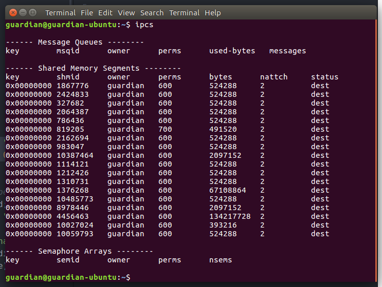
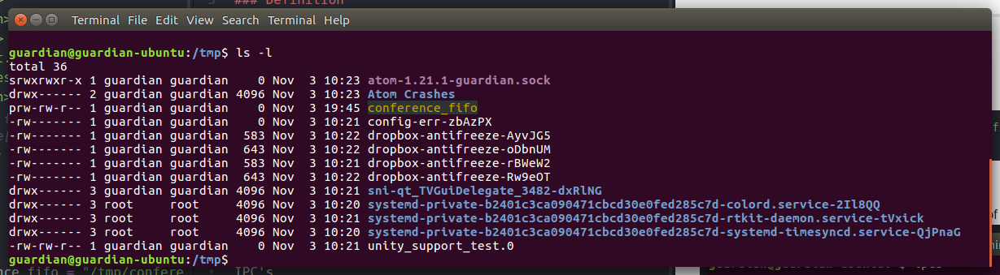
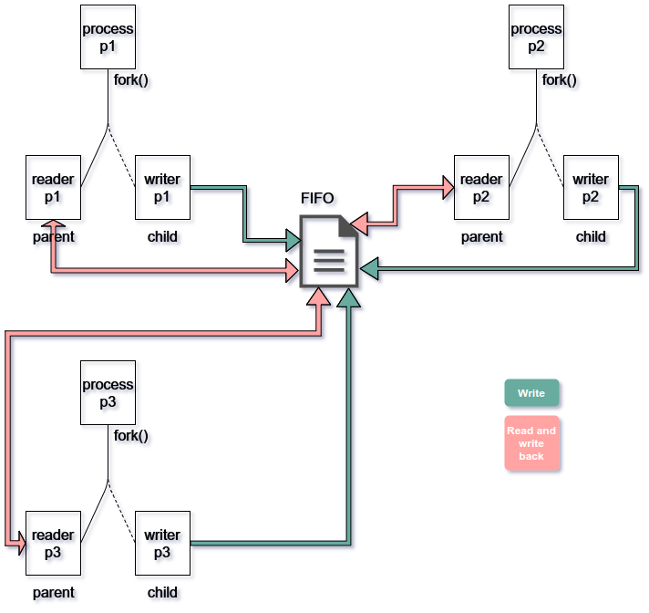

# Conference Call using 1-Fifo

## Definition

**FIFO** is an **IPC**(Inter Process Communication) method which uses a **named pipe**.

- It is an extension to the traditional pipe concept on Unix. A traditional pipe is "unnamed" and lasts only as long as the process.
- A named pipe, however, can last as long as the system is up, beyond the life of the process. It can be deleted if no longer used.
- Usually a named pipe appears as a file, and generally processes attach to it for inter-process communication. A FIFO file is a special kind of file on the local storage which allows two or more processes to communicate with each other by reading/writing to/from this file.
- A FIFO special file is entered into the filesystem by calling mkfifo() in C. Once we have created a FIFO special file in this way, any process can open it for reading or writing, in the same way as an ordinary file. However, it has to be open at both ends simultaneously before you can proceed to do any input or output operations on it.

--------------------------------------------------------------------------------

## Creating a FIFO

To create a fifo we use :

`int mkfifo(const char *pathname, mode_t mode);`

```c++
char* conference_fifo = "/tmp/conference_fifo";
mkfifo(conference_fifo, 0666);
```

The `0666` is the permission of the FIFO

To debug IPC's we use `$ ipcs` to show the lists of IPC's 

However FIFO's are like virtual files which are not listed here. Calling

```bash
$ ls -l
```

in the fifo directory we find



**conference_fifo** in yellow is the file

## Architecture and Usage

The Architecture of the implementation is as follows:



**Note:** this program has a bug that it will work only with 3 users unless modified.

Open up 3 terminals and run

```bash
$ gcc -o conference conference.c
$ ./conference
```

in each of them and a **userid** and **username** will be asked. Make sure to use consecutive 0,1,2 as userid's and any name for userid


--------------------------------------------------------------------------------

## How it works

Each process inputs a userid and username and forks out a child process.

```c++
pid_t pid = fork();
char str_rec[123], str_send[100];
```

--------------------------------------------------------------------------------

### Strcture of the message

A **123 byte** string. The flag bits are **0** or **1**. If the **i** th bit is set, it mean process with **userid=i** has read the msg.<br>


--------------------------------------------------------------------------------

### Parent Process

The parent pocess acts like a reader which reads data from the fifo.

1. **If all flag == 1 :**

  - Discard the message

2. **else if flag[userid] ==1 :**

  - Write msg back to FIFO as it was

3. **else:**

  - Print message on terminal.
  - Set flag[userid] = 1.
  - Write back to the FIFO Modifies it to change the flag of the bit string

```c++
if(pid != 0){
    // Parent process is the reading end of FIFO
    while (1)
    {
        int done=1;
        // First open in read only and read
        fd = open(conference_fifo,O_RDONLY);
        read(fd, str_rec, 123);
        // Print the read string and close
        char flag[3];
        int i;
        for(i=0;i<3;i++){
            flag[i] = str_rec[i];
            if(str_rec[i] == '0')
                done = 0;
        }
        if(flag[id] == '0'){
            if(strlen(str_rec)>1)
                printf("\n%s\n", str_rec+3);
            str_rec[id] = '1';
        } else {

        }
        close(fd);
        if(done == 0){
            fd = open(conference_fifo,O_WRONLY);
            write(fd, str_rec, strlen(str_rec)+1);
            close(fd);
        }
    }
}
```

--------------------------------------------------------------------------------

### Child Process

Whenever a message is send, the child writes is to the **FIFO**

```c++
else{
    //Child process sends data to FIFO
    while (1) {
        fd = open(conference_fifo,O_WRONLY);
        fgets(str_send, 100, stdin);
        if(strcmp(str_send, "exit") == 0)
            break;
        char msg[123];
        strcpy(msg, "000");
        strcat(msg, username);
        strcat(msg, str_send);
        write(fd, msg, strlen(msg)+1);
        close(fd);
    }
}
```

--------------------------------------------------------------------------------
#### Author
Aishik Pyne  
Jadavpur University, CSE 3rd Year
Roll: 12
