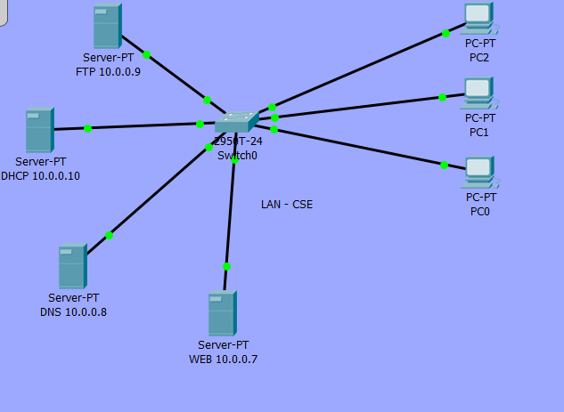

# Cicso packet tracer

**author:** Aishik Pyne  
**class:** BCSE3  
**Roll:** 12  

**Central switch:** Cisco switch

**Static Servers:**
- DHCP at 10.0.0.10
- DNS at 10.0.0.8
- FTP at 10.0.0.9

**Clients**  
- N numnber of  Laptops/PC

**Settings**
- DHCP
  - Start IP: 10.0.0.20
  - Max user: 256
  - Dedult Gateway: 10.0.0.1
- DNS
  - A records
    - cse.myjdvu.com - 10.0.0.7
    - ftp.myjdvu.com - 10.0.0.9
- FTP
  - Users
    - uname: cisco, pass: cisco
    - uname: aishik, pass: aishik
- WEB
  - Port
    - 80: http
    - 403: https
  - Files at web root
    - index.html
    - map.html
