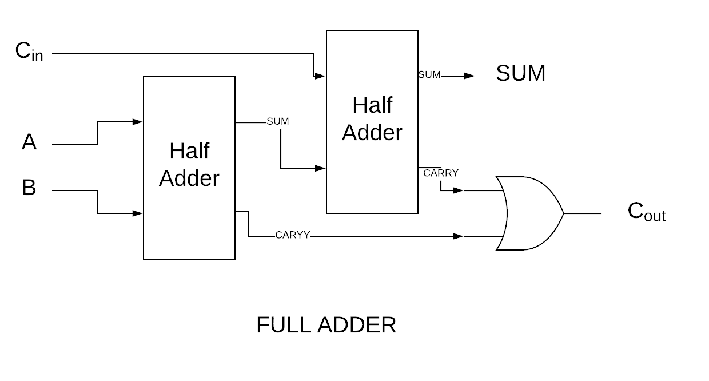
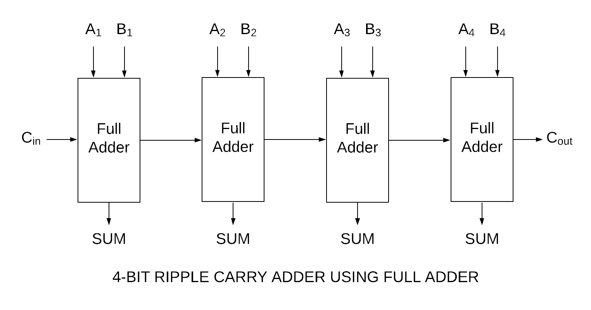
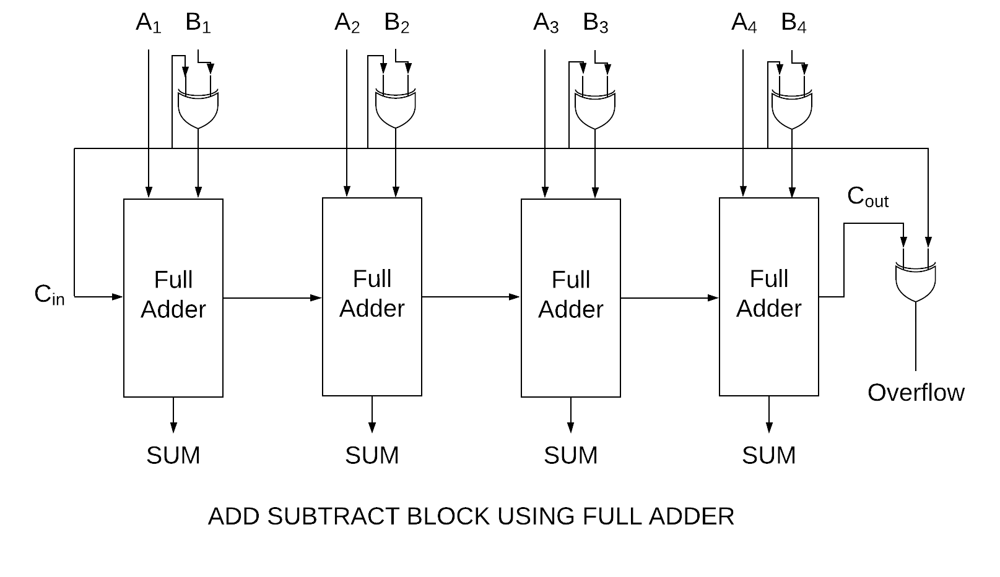
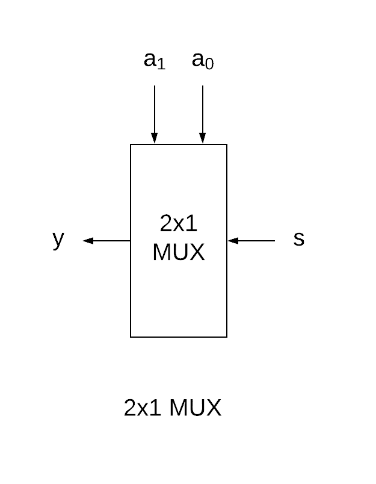
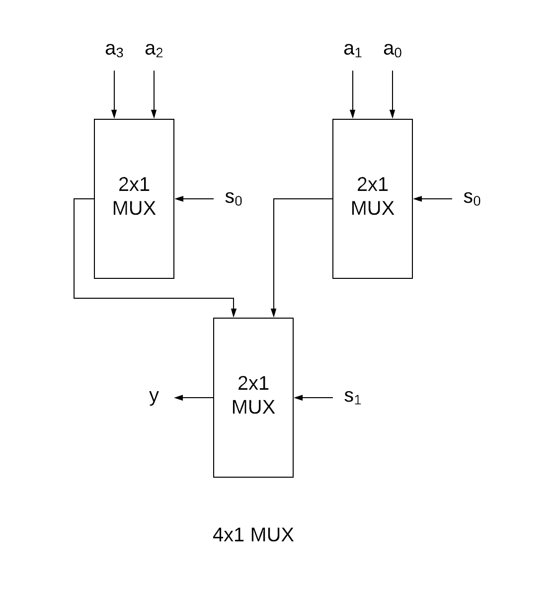
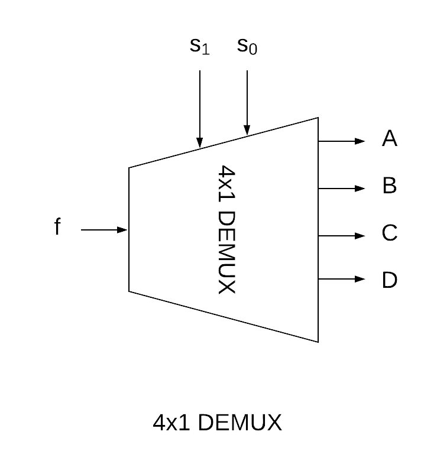
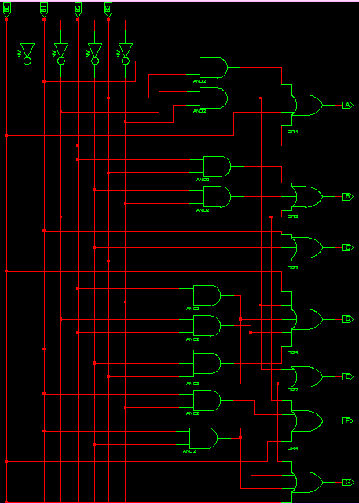
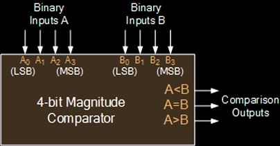
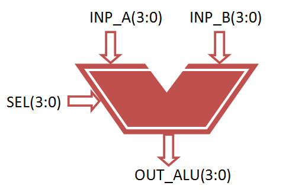

# VSLI LAB REPORT

## Index

1. [x] Half Adder
2. [x] Full Adder Deisgn using Half Adder
3. [x] 4 Bit Ripple Carry Adder design using 1 Bit Full Adder.
4. [x] Adder Subtractor Block
5. [ ] BCD Adder
6. [x] 2:1 Multiplexer
7. [x] 4:1 Multiplexer design using 2:1 Multiplexer
8. [x] 1:4 Demultiplexer
9. [ ] 3:8 Decoder
10. [ ] Flip Flip
    - D Flip Flip
    - RS Flip Flip
    - JK Flip Flip
    - T Flip Flip
11. [x] 7 Segment Decoder
12. [x] 4 Bit Comparator
13. [ ] Binary-to-Gray Code Converter
14. [x] 4 Bit ALU

---

## Half Adder

**Experiment Number** : 1  

**Experiment Name** : Half Adder

**Circuit Diagram** :


**Truth Table** :

 |   A   |   B   |  SUM  | CARRY |
 | :---: | :---: | :---: | :---: |
 |   0   |   0   |   0   |   0   |
 |   0   |   1   |   1   |   0   |
 |   1   |   0   |   1   |   0   |
 |   1   |   1   |   0   |   1   |

**VHDL Code**

```vhdl
----------------------------------------------------------------------------------
-- Design Name:    1 Bit Half Adder Design 
-- Module Name:    halfadder - Behavioral 
----------------------------------------------------------------------------------
library IEEE;
use IEEE.STD_LOGIC_1164.ALL;
use IEEE.STD_LOGIC_ARITH.ALL;
use IEEE.STD_LOGIC_UNSIGNED.ALL;

entity halfadder is
    Port ( a : in  STD_LOGIC;
           b : in  STD_LOGIC;
           sum : out  STD_LOGIC;
           cout : out  STD_LOGIC);
end halfadder;

architecture Behavioral of halfadder is

begin

sum<= a xor b;
cout<= a and b;


end Behavioral;

```

---

## Full Adder Deisgn using Half Adder

**Experiment Number** : 2

**Experiment Name** : Full Adder Deisgn using Half Adder

**Circuit Diagram**  



**Truth Table** :

 |   A   |   B   |  Cin  |  SUM  | Cout  |
 | :---: | :---: | :---: | :---: | :---: |
 |   0   |   0   |   0   |   0   |   0   |
 |   0   |   0   |   1   |   1   |   0   |
 |   0   |   1   |   0   |   1   |   0   |
 |   0   |   1   |   1   |   0   |   1   |
 |   1   |   0   |   0   |   1   |   0   |
 |   1   |   0   |   1   |   0   |   1   |
 |   1   |   1   |   0   |   0   |   1   |
 |   1   |   1   |   1   |   1   |   1   |

**VHDL Code** :

```vhdl
----------------------------------------------------------------------------------
-- Design Name:    1Bit Full Addrer design using Half Adder
-- Module Name:    fulladder - Behavioral 
----------------------------------------------------------------------------------
library IEEE;
use IEEE.STD_LOGIC_1164.ALL;
use IEEE.STD_LOGIC_ARITH.ALL;
use IEEE.STD_LOGIC_UNSIGNED.ALL;


entity fulladder is
    Port ( a : in  STD_LOGIC;
           b : in  STD_LOGIC;
           cin : in  STD_LOGIC;
           sum : out  STD_LOGIC;
           cout : out  STD_LOGIC);
end fulladder;

architecture Behavioral of fulladder is

-- Componet of Half Adder
component halfadder is
    Port ( a : in  STD_LOGIC;
           b : in  STD_LOGIC;
           sum : out  STD_LOGIC;
           cout : out  STD_LOGIC);
end component;

signal m,n,l:std_logic;

begin

a0:halfadder port map(a,b,m,n);
a1:halfadder port map(m,cin,sum,l);
cout<= l or n;

end Behavioral;


```

---

## 4 Bit Ripple Carry Adder design using 1 Bit Full Adder

**Experiment Number** : 3

**Experiment Name** : 4 Bit Ripple Carry Adder design using 1 Bit Full Adder

**Circuit Diagram** :



**VHDL Code** :

```vhdl
----------------------------------------------------------------------------------
-- Design Name:    4 Bit Ripple Carry Adder design using 1 Bit Full Adder
-- Module Name:    rippleadder - Behavioral 
----------------------------------------------------------------------------------
library IEEE;
use IEEE.STD_LOGIC_1164.ALL;
use IEEE.STD_LOGIC_ARITH.ALL;
use IEEE.STD_LOGIC_UNSIGNED.ALL;


entity rippleadder is
    Port ( a : in  STD_LOGIC_VECTOR (3 downto 0);
           b : in  STD_LOGIC_VECTOR (3 downto 0);
           cin : in  STD_LOGIC;
           sum : out  STD_LOGIC_VECTOR (3 downto 0);
           cout : out  STD_LOGIC);
end rippleadder;

architecture Behavioral of rippleadder is

-- Componet of Full Adder
component fulladder is
    Port ( a : in  STD_LOGIC;
           b : in  STD_LOGIC;
           cin : in  STD_LOGIC;
           sum : out  STD_LOGIC;
           cout : out  STD_LOGIC);
end component;

-- Intermediate Carry declaration
signal c1,c2,c3: STD_LOGIC;

begin

FA1: fulladder port map( a(0), b(0), cin, s(0), c1);
FA2: fulladder port map( a(1), b(1), c1, s(1), c2);
FA3: fulladder port map( a(2), b(2), c2, s(2), c3);
FA4: fulladder port map( a(3), b(3), c3, s(3), cout);

end Behavioral;


```

---

## Adder Subtractor Block

**Experiment Number** : 4

**Experiment Name** : Adder Subtractor Block

**Circuit Diagram** :



**VHDL Code** :

```vhdl
----------------------------------------------------------------------------------
-- Design Name:    Modified Full Adder
-- Module Name:    fulladder-modified - Behavioral 
----------------------------------------------------------------------------------
library ieee;
use ieee.std_logic_1164.all;
entity fulladder is
   port( X, Y, Cin : in std_logic;
         sum, Cout : out std_logic);
end fulladder;

architecture Behavioral of fulladder is
begin
   sum &amp;lt;= (X xor Y) xor Cin;
   Cout &amp;lt;= (X and (Y or Cin)) or (Cin and Y);
end Behavioral;
```

```vhdl
----------------------------------------------------------------------------------
-- Design Name:    4 bit Adder Subtractor
-- Module Name:    addsubblock - Behavioral 
----------------------------------------------------------------------------------
library ieee;
use ieee.std_logic_1164.all;

-- Define addsubblock ports
entity addsubblock is
   port( OP: in std_logic;
          A,B  : in std_logic_vector(3 downto 0);
          R  : out std_logic_vector(3 downto 0);
          Cout, OVERFLOW : out std_logic);
end addsubblock;

architecture Behavioral of addsubblock is

-- Componet of Full Adder
component fulladder is
  port( X, Y, Cin : in std_logic;
        sum, Cout : out std_logic);
end component;

signal C1, C2, C3, C4: std_logic;
signal TMP: std_logic_vector(3 downto 0);

begin
TMP &lt;= A xor B;
FA0:fulladder port map(A(0),TMP(0),OP, R(0),C1);-- R0
FA1:fulladder port map(A(1),TMP(1),C1, R(1),C2);-- R1
FA2:fulladder port map(A(2),TMP(2),C2, R(2),C3);-- R2
FA3:fulladder port map(A(3),TMP(3),C3, R(3),C4);-- R3
OVERFLOW &lt;= C3 XOR C4 ;
Cout &lt;= C4;
end Behavioral;
```

---

## 2x1 Multiplexer

**Experiment Number** : 5

**Experiment Name** : 2x1 Multiplexer

**Circuit Diagram** :



**Truth Table** :

 |   S   |   Y   |
 | :---: | :---: |
 |   0   |  a0   |
 |   1   |  a1   |

**VHDL Code** :

```vhdl
----------------------------------------------------------------------------------
-- Design Name:    2:1 Multiplexer Design
-- Module Name:    mux21 - Behavioral 
----------------------------------------------------------------------------------
library IEEE;
use IEEE.STD_LOGIC_1164.ALL;

entity mux21 is
    Port ( a : in  STD_LOGIC_VECTOR (1 downto 0);
           s : in  STD_LOGIC;
           y : out  STD_LOGIC);
end mux21;

architecture Behavioral of mux41 is

begin

-- Multiplexing process
process(a,s)
variable temp:std_logic;
begin
case s is
    when "0" => temp:=a(0);
    when "1" => temp:=a(1);
    when others => temp:='X';
    end case;
    y<= temp;
end process;

end Behavioral;

```

---

## 4x1 Multiplexer using 2x1 Multiplexer

**Experiment Number** : 7

**Experiment Name** : 4x1 Multiplexer using 2x1 Multiplexer

**Circuit Diagram** :



**Truth Table** :

 |  S0   |  S1   |   Y   |
 | :---: | :---: | :---: |
 |   0   |   0   |  a0   |
 |   0   |   1   |  a1   |
 |   1   |   0   |  a2   |
 |   1   |   1   |  a4   |


**VHDL Code** :

```vhdl
----------------------------------------------------------------------------------
-- Design Name:    2:1 Multiplexer Design
-- Module Name:    mux21 - Behavioral 
----------------------------------------------------------------------------------
library IEEE;
use IEEE.STD_LOGIC_1164.ALL;

entity mux41 is
    Port ( a : in  STD_LOGIC_VECTOR (3 downto 0);
           s : in  STD_LOGIC_VECTOR (1 downto 0);
           y : out  STD_LOGIC);
end mux41;

architecture Behavioral of mux41 is

component mux21 is
    Port ( a : in  STD_LOGIC_VECTOR (1 downto 0);
           s : in  STD_LOGIC;
           y : out  STD_LOGIC);
end component;

signal t1, t2:std_logic;

begin

MX0:mux21 port map(a(0),a(1),s(0), t1);
MX1:mux21 port map(a(2),a(3),s(0), t2);
MX2:mux21 port map(t1,t2,s(1), y);

end Behavioral;

```

---

## 4x1 De Multiplexer

**Experiment Number** : 8

**Experiment Name** : 4x1 De Multiplexer

**Circuit Diagram** :



**Truth Table** :

 |   F   |  S0   |  S1   |   A   |   B   |   C   |   D   |
 | :---: | :---: | :---: | :---: | :---: | :---: | :---: |
 |   1   |   0   |   0   |   1   |   0   |   0   |   0   |
 |   1   |   0   |   1   |   0   |   1   |   0   |   0   |
 |   1   |   1   |   0   |   0   |   0   |   1   |   0   |
 |   1   |   1   |   1   |   0   |   0   |   0   |   1   |
 |   0   |   X   |   X   |   0   |   0   |   0   |   0   |

**VHDL Code** :

```vhdl
----------------------------------------------------------------------------------
-- Design Name:    4:1 De Multiplexer Design
-- Module Name:    demux41 - Behavioral 
----------------------------------------------------------------------------------
library IEEE;
use IEEE.STD_LOGIC_1164.ALL;

entity demux41 is
    Port ( a : in  STD_LOGIC_VECTOR (3 downto 0);
           s : in  STD_LOGIC_VECTOR (1 downto 0);
           y : out  STD_LOGIC);
end demux41;

architecture Behavioral of demux41 is

begin

process(f,s)

    variable temp:std_logic;

    begin
    case s is
        when "00" => temp:=A;
        when "01" => temp:=B;
        when "10" => temp:=C;
        when "11" => temp:=D;
        when others => temp:='X';
    end case;
    y<= temp and f;

    end process;

end Behavioral;

```

---

## 7 Segment Decoder

**Experiment Number** : 11

**Experiment Name** : 7 Segment Decoder

**Circuit Diagram** :



**Truth Table** :

| B3 B2 B1 B0 | ABCDEFG |
| :---------: | :-----: |
|    0000     | 0000001 |
|    0001     | 1001111 |
|    0010     | 0010010 |
|    0011     | 0000110 |
|    0100     | 1001100 |
|    0101     | 0100100 |
|    0110     | 0100000 |
|    0111     | 0001111 |
|    1000     | 0000000 |
|    1001     | 0000100 |

**VHDL Code** :

```vhdl
library IEEE;
use IEEE.STD_LOGIC_1164.ALL;

entity bcd_7seg is
Port ( B0,B1,B2,B3 : in STD_LOGIC;
A,B,C,D,E,F,G : out STD_LOGIC);
end bcd_7seg;

architecture Behavioral of bcd_7seg is

begin

A <= B0 OR B2 OR (B1 AND B3) OR (NOT B1 AND NOT B3);
B <= (NOT B1) OR (NOT B2 AND NOT B3) OR (B2 AND B3);
C <= B1 OR NOT B2 OR B3;
D <= (NOT B1 AND NOT B3) OR (B2 AND NOT B3) OR (B1 AND NOT B2 AND B3) OR (NOT B1 AND B2) OR B0;
E <= (NOT B1 AND NOT B3) OR (B2 AND NOT B3);
F <= B0 OR (NOT B2 AND NOT B3) OR (B1 AND NOT B2) OR (B1 AND NOT B3);
G <= B0 OR (B1 AND NOT B2) OR ( NOT B1 AND B2) OR (B2 AND NOT B3);

end Behavioral;

```

---

## 4 Bit Comparator

**Experiment Number** : 12

**Experiment Name** : 4 Bit Comparator

**Circuit Diagram** :



**VHDL Code** :

```vhdl
Library ieee;
use ieee.std_logic_1164.all;
use ieee.std_logic_arith.all;
use ieee.std_logic_unsigned.all;

entity VHDL_Binary_Comparator is
  port (
    inp-A,inp-B   : in std_logic_vector(3 downto 0);
    greater, equal, smaller  : out std_logic
   );
end VHDL_Binary_Comparator ; 

architecture bhv of VHDL_Binary_Comparator is
begin
greater <= '1' when (inp-A > inp-B)
else '0';
equal <= '1' when (inp-A = inp-B)
else '0';
smaller <= '1' when (inp-A < inp-B)
else '0';
end bhv;
```

---

## 4 Bit ALU

**Experiment Number** : 14

**Experiment Name** : 4 Bit ALU

**Circuit Diagram** :



**Truth Table** :

|  SI0  |  SI0  |  SI1  |   OP    |
| :---: | :---: | :---: | :-----: |
|   0   |   0   |   0   |   A+B   |
|   0   |   0   |   1   |   A-B   |
|   0   |   1   |   0   |   A-1   |
|   0   |   1   |   1   |   A+1   |
|   1   |   0   |   0   | A and B |
|   1   |   0   |   1   | A or B  |
|   1   |   1   |   0   |  not A  |
|   1   |   1   |   1   | A xor B |

**VHDL Code** :

```vhdl
library IEEE;
use IEEE.STD_LOGIC_1164.ALL;
use IEEE.NUMERIC_STD.ALL;

entity alu is
 Port ( inp_a : in signed(3 downto 0);
 inp_b : in signed(3 downto 0);
 sel : in STD_LOGIC_VECTOR (2 downto 0);
 out_alu : out signed(3 downto 0));
end alu;

architecture Behavioral of alu is
begin
process(inp_a, inp_b, sel) 
begin
case sel is
 when "000" => 
 out_alu<= inp_a + inp_b; --addition 
 when "001" => 
 out_alu<= inp_a - inp_b; --subtraction 
 when "010" => 
 out_alu<= inp_a - 1; --sub 1 
 when "011" => 
 out_alu<= inp_a + 1; --add 1 
 when "100" => 
 out_alu<= inp_a and inp_b; --AND gate 
 when "101" => 
 out_alu<= inp_a or inp_b; --OR gate 
 when "110" => 
 out_alu<= not inp_a ; --NOT gate 
 when "111" => 
 out_alu<= inp_a xor inp_b; --XOR gate 
 when others =>
 NULL;
end case; 
 
end process; 

end Behavioral;
```

---
